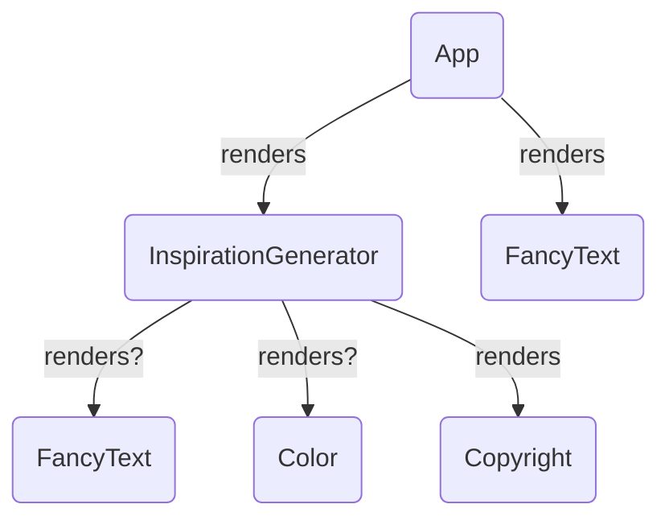
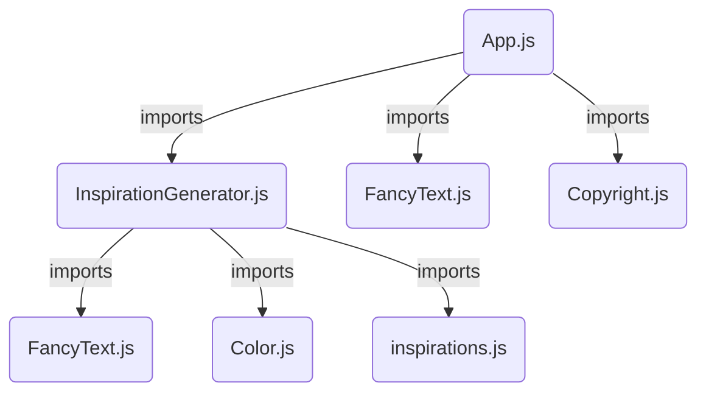

## 리액트 UI 표현하기

- 첫 번째 리액트 컴포넌트 작성하기
- 컴포넌트 Import 및 Export 하기
- JSX로 JavaScript에 마크업 추가하기
- JSX에 중괄호를 사용해 JavaScript 기능 이용하기
- Props를 사용하여 컴포넌트 구성하기
- 조건부 렌더링
- 리스트 렌더링
- 컴포넌트를 순수하게 유지하기
- 트리로서의 UI

[리액트v19 공식문서-UI 표현하기] <https://ko.react.dev/learn/describing-the-ui>

---

## 첫 번째 리액트 컴포넌트 작성하는 방법

### 리액트 컴포넌트

마크업으로 뿌릴 수 있는 JavaScript 함수. 리액트 애플리케이션은 리액트 컴포넌트로 구성된다.
<br />

- 리액트 앱은 루트 컴포넌트에서 시작됨
- 리액트의 모든 UI는 컴포넌트로 구성됨 - 버튼, 사이드바, 리스트, 페이지 전체까지 모두 컴포넌트로 구성됨
- 리액트는 빈 HTML 파일에서 시작하고, JavaScript가 로드되면서 화면을 그려줌
- 단, Next.js 같은 SSR 프레임워크는 HTML을 미리 생성할 수도 있음
- 리액트를 웹사이트의 특정 부분에서만 사용하는 것도 가능 ⇒ 이런 경우, 여러 개의 루트 컴포넌트가 한 페이지에 존재할 수 있음

<br />

### 컴포넌트 정의하기

```jsx
export default function Profile() {
  return 
}
```

(1) 컴포넌트 내보내기 `export default`

(2) 함수 정의하기 `function 함수명() { }`

- 리액트 컴포넌트 함수 이름은 **대문자로 시작**해야함(HTML태그와 구분됨)

(3) 마크업 반환하기 `function 함수명() { return (JSX마크업) }`

<br/>

### 컴포넌트 중첩 및 구성

- 같은 파일에 여러 컴포넌트를 포함할 수 있다. → 컴포넌트가 상대적으로 작거나 서로 밀접하게 관련되어있을 때
- `주의` 컴포넌트는 다른 컴포넌트를 렌더링할 수 있지만, 컴포넌트 안에 다른 컴포넌트를 정의하면 안된다.

```jsx
export default function Gallery() {
  // 절대 컴포넌트 안에 다른 컴포넌트를 정의하면 안됨
  function Profile() {
    //...
  }
  // ...
}
```

- 컴포넌트는 항상 최상위 레벨에서 정의

```jsx
// 부모 컴포넌트
export default function Gallery() {
  // ...
  return (
    <div>
      <h1>Gallery</h1>
      <Profile></Profile>
    </div>
  )
}
// 자식 컴포넌트
function Profile() {
  // ...
}
```

<br/>

### 🧩 컴포넌트 라이브러리

- `Chakra UI` : 리액트 기반의 컴포넌트 라이브러리로 접근성, 스타일링 편의성, 개발 생산성을 중점으로 설계된 UI 라이브러리.
  - 사용하기 쉬운 스타일링 시스템 - props로 스타일을 쉽게 조정
  - 접근성 지원(WCAG 원칙 반영)
  - 확장성 - 기본 테마를 커스터마이징하기 쉬움
  - 다크모드 지원 - useColorMode()훅을 사용해 다크모드 손쉽게 적용
  - 타입스크립트 지원 - 타입 안정성 높음
  - CSS-in-JS 방식 사용으로 SSR 환경에서 성능 저하가 발생할 수 있음
- `Material UI`: 구글의 머티리얼 디자인 시스템 기반으로 한 리액트 UI 라이브러리.
  - 다양한 UI 컴포넌트 제공, 고급 컴포넌트 제공
  - 구글 머티리얼 디자인 기반으로 일관된 UI를 유지하기 좋고 반응형 지원
  - 강력한 테마 시스템(ThemeProvider)
  - 타입스크립트 지원
  - SSR 최적화
  - 커스터마이징이 어렵고 정형화된 디자인
  - CSS-in-JS 방식 사용으로 SSR 환경에서 성능 저하가 발생할 수 있음
- `Radix UI`: 헤드리스 UI 라이브러리
  - 대형 프로젝트에 적합
  - 접근성 지원 뛰어남(WAI-ARIA 표준 따름)
  - 서버 친화적(직접 스타일 적용 필요)
  - 고급 컴포넌트 많음
  - 상태 관리를 위한 Unstyled 컴포넌트 제공
- `Shadcn/ui`: 헤드리스 UI 라이브러리. Tailwind와 결합해 더 쉽게 사용할 수 있도록 최적화된 라이브러리
  - 디자인이 있는 컴포넌트도 제공되지만, 필요하면 스타일을 제거하고 원하는 대로 수정 가능
  - 대부분의 UI 컴포넌트를 제공하며, 필요한 컴포넌트만 가져올 수 있음
  - 자동 다크 모드 & 테마 지원
  - 서버 친화적(React Server Components 지원)
- **헤드리스 컴포넌트?**
  - UI를 제공하지 않음 → 스타일이나 마크업 없이 로직만 포함
  - 완전한 재사용성 → 다양한 UI라이브러리나 스타일링 방식과 조합 가능
  - Render Props 또는 Hooks 사용 → 자유로운 UI 커스터마이징

---

## 컴포넌트 Import 및 Export 하기

### Default vs Name Export

| Syntax             | Default export                                                                                   | Named export                                                                          |
| ------------------ | ------------------------------------------------------------------------------------------------ | ------------------------------------------------------------------------------------- |
| **export 하는 법** | `export default function Button() {}`                                                            | `export function Button() {}`                                                         |
| **import 하는 법** | `import Button from './button.js'`                                                               | `import { Button } from './button.js'`                                                |
| **역할**           | 파일에서 기본 컴포넌트임을 명시                                                                  | 여러 컴포넌트를 export할 때 사용                                                      |
| **특징**           | - 파일 내 Default export는 하나만 존재할 수 있음 <br> - import할 때 다른 이름으로 가져올 수 있음 | - 파일 내 여러 개의 named export를 사용할 수 있음 <br> - import할 때 이름이 같아야 함 |

<br/>

### 🤔 컴포넌트를 다른 파일로 분리할 때 고려할 것

- 단일 책임 원칙
- 재사용 가능성
- 가독성
- 상태와 라이프사이클
- UI요소 : 서로 다른 UI 요소는 별도의 컴포넌트로 분리

---

## JSX로 마크업 작성하기

**JSX란?** 리액트 컴포넌트에서 마크업을 표현하는 확장된 문법으로, HTML과 유사하지만 더 엄격하고 JavaScript의 동적인 표현식을 표현할 수 있다.

<br/>

### JSX 규칙

(1) 하나의 루트 엘리먼트로 반환할 것

- JSX는 내부적으로 일반 JavaScript 객체로 변환되기 때문에 하나의 함수에서 두 개의 객체를 반환할 수 없다. → 따라서 여러 엘리먼트를 반환할 때, `<div>...</div>` 또는 `<>...</>` 등 하나의 부모 태그로 감싸서 반환해야한다.
- `주의` React.Fragment의 단축 문법인 `<>...</>`는 key를 줄 수 없으므로 key를 사용해야할 때는 `<React.Fragment key={item.id}>...</React.Fragment>`를 사용하거나 다른 html 태그를 사용해야함

(2) 모든 태그는 명시적으로 닫혀있어야 함 `` `<li></li>`

(3) 캐멀 케이스로 작성할 것

- JSX에서 작성된 어트리뷰트는 JavaScript 객체의 키가 되는데, **JavaScript 변수명에는 대시를 포함하거나 `class`와 같은 예약어를 사용할 수 없기 때문에,** **HTML, SVG 어트리뷰트 대부분을 캐멀 케이스로 작성**해야 한다.
  - ex) stroke-width → storkeWidth, class → className
- 예외적으로 `data-*` 와 `aria-*` 속성은 그대로 사용할 수 있음
  - `data-*` 개발자가 HTML요소에 추가 정보를 저장하는 용도, 브라우저는 이를 무시하고 작동
  - `aria-*` 장애가 있는 사용자를 위한 보조 기술(스크린 리더 등)을 지원하기 위해 사용. ARIA(Accessible Rich Internet Applications) 웹 접근성을 높이는 표준

---

## JSX에서 중괄호 이용하여 JavaScript 사용하기

JSX를 사용해 마크업 내부에 JavaScript를 추가하거나 동적인 프로퍼티를 참조할 수 있다.

### ✅ 문자열 속성, 자바스크립트 변수 참조하기

```jsx
// 문자열 어트리뷰트는 작은따옴표('') 또는 큰따옴표("")로 묶어서 전달
// 자바스크립트 변수는 중괄호({ })로 감싸서 전달
export default function Avatar() {
  const imgUrl = 'https://i.imgur.com/avatar.jpg'
  return 
}
```

<br/>

### ✅ JSX안에서 JavaScript 함수 호출하기

```jsx
const today = new Date();

const formatDate(date) = () => {
 return new Intl.DateTimeFormat(
  'en-US',
  { weekday: 'long' }
 ).format(date);
}

export default function TodoList() {
 return (
  <h1>To Do List for {formatDate(today)}</h1>
 )
}
```

> 🚫중괄호 사용할 때 주의
>
> - JSX태그 내 컨텐츠에서 중괄호를 사용할 수 있지만 태그에 직접 사용할 수는 없다.
> - src=”{imgUrl}” 로 쓰면 “{imgUrl}”문자열로 전달된다

<br/>

### ✅ JSX안에서 JavaScript 객체 사용하기

```jsx
const styles = {
  backgroundColor: 'black',
  color: 'pink'
}
export default function TodoList() {
  return (
   // style 어트리뷰트와 같이 객체를 전달할 때는 {{ }} 중괄호를 쌍으로 감싸야함
   // 인라인 스타일 프로퍼티는 캐멀케이스로 작성
    <ul style={ /* inline style object */ }>
      <li>Improve the videophone</li>
      <li>Prepare aeronautics lectures</li>
      <li>Work on the alcohol-fuelled engine</li>
    </ul>
  );
```

```jsx
const person = {
  name: 'ginger',
  theme: {
    backgroundColor: 'green',
    color: 'orange',
  },
}
// 객체를 따로 정의하고 중괄호 안에서 참조
export default function TodoList() {
  return (
    <div style={person.theme}>
      <h1>{person.name}</h1>
    </div>
  )
}
```

---

## 컴포넌트에 Props 전달하기

리액트 컴포넌트 함수는 하나의 인자, `props` 객체를 받는다

<br/>

### 자식 컴포넌트에 props 전달하기

```jsx
export default function Profile() {
  const person = { name: 'ginger', imgId: 'abc123' }
  return <Avatar person={person} size={100} />
}
```

<br/>

### 자식 컴포넌트에서 props 읽기

```jsx
// size = 200 으로 디폴트값을 설정할 수 있다
// size prop이 없거나 undefined로 전달될 때 디폴트값으로 설정됨
function Avatar({ person, size = 200 }) {
  return (
    <div>
      
      <h1>{person.name}</h1>
    </div>
  )
}
```

- props가 반복적으로 전달될 때 spread 문법을 사용하면 간결하게 표현 가능

```jsx
function Profile(props) {
  return (
    <div className='card'>
      <Avatar {...props} />
    </div>
  )
}
```

<br/>

### 자식을 JSX로 전달하기

JSX 태그 내에 콘텐츠를 중첩하면, 부모 컴포넌트는 해당 콘텐츠를 `children`이라는 prop으로 받는다

- 콘텐츠의 형식에는 제한 없이 중첩된 JSX는 어느 것이든 다 `children` prop으로 받아 렌더링할 수 있다.(다른 컴포넌트가 될 수도, 일반 텍스트가 될 수도 있음)

```jsx
const MyProfile = () => {
  return (
    <div>
      <h1>Photo</h1>
      
    </div>
  )
}

const Card = ({ children }) => {
  return (
    <div className='card'>
      <div className='card-content'>{children}</div>
    </div>
  )
}

export default function Profile() {
  return (
    <div>
      <Card>
        <MyProfile />
      </Card>
      <Card>
        <h1>About</h1>
        <p>
          Aklilu Lemma was a distinguished Ethiopian scientist who discovered a
          natural treatment for schistosomiasis.
        </p>
      </Card>
    </div>
  )
}
```

<br/>

### 시간에 따라 Props가 변하는 방식

```jsx
export default function Clock({ color, time }) {
  return (
    // 시간의 흐름에 따라 보여지는 time도 계속 바뀜(props의 time이 갱신되기 때문)
    <h1 style={{ color: color }}>{time}</h1>
  )
}
```

- 부모 컴포넌트에서 props로 전달하는 데이터가 변경되면 이전의 props는 버려지고(기존 props가 차지했던 메모리 회수) 새로운 props객체를 전달한다.
- props는 읽기 전용 스냅샷으로 props가 연결된 state를 변경해야한다

---

## 조건부 렌더링

### 조건부로 JSX 반환하기

(1) `if` 연산자 사용하기

```jsx
if (isPacked) {
  return <li className='item'>{name} ✅</li>
}
return <li className='item'>{name}</li>
```

<br/>

(2) `null` 사용해 아무것도 반환하지 않기

- null을 반환하면 아무것도 렌더링되지 않음

```jsx
if (isPacked) {
  return null
}
return <li className='item'>{name}</li>
```

<br/>

(3) `? :`삼항 조건 연산자, `&&` 사용해 간단하게 표현하기

```jsx
if (isPacked) {
  return <li className='item'>{name} ✅</li>
}
return <li className='item'>{name}</li>
```

⬇️ 삼항 조건 연산자 `? :` 사용

```jsx
return <li className='item'>{isPacked ? name + ' ✅' : name}</li>
```

⬇️ 논리 AND 연산자 `&&` 사용

- isPacked가 true면 ✅ 를 렌더링하고, false면 아무것도 렌더링 하지 않음
- `주의` && 왼쪽에 숫자 0이 오면 ‘0’ 자체를 렌더링함

```jsx
return (
  <li className='item'>
    {name} {isPacked && '✅'}
  </li>
)
```

> 💡 JSX 요소는 내부 상태를 가진 객체가 아니고 “렌더링 설명서(blueprint)”일 뿐이다. JSX에 작성한 태그들은 실제 DOM요소가 아니다. 실제 DOM 요소는 리액트가 이 설명서를 바탕으로 렌더링할 때 브라우저에서 생성된다.

<br/>

(4) 변수에 조건부로 JSX 할당하기

```jsx
function Item({ name, isPacked }) {
  let itemContent = name
  if (isPacked) {
    // JSX 표현식을 변수에 할당할 수 있음
    itemContent = <del>{name + ' ✅'}</del>
  }
  return <li className='item'>{itemContent}</li>
}

export default function PackingList() {
  return (
    <section>
      <Item isPacked={true} name='Space suit' />
    </section>
  )
}
```

---

## 리스트 렌더링

<br/>

### 배열 데이터를 컴포넌트로 렌더링하기 : `map()`

```jsx
const animals = ['rabbit', 'tiger', 'panda']

export default function List() {
  const listItems = animals.map((animal, idx) => <li key={idx}>{animal}</li>)
  return <ul>{listItems}</ul>
}
```

### 배열 항목들을 필터링해 특정 컴포넌트만 렌더링하기: `filter()`

```jsx
const people = [
  {
    id: 0,
    name: 'Creola',
    profession: 'mathematician',
  },
  {
    id: 1,
    name: 'Mario',
    profession: 'chemist',
  },
  {
    id: 2,
    name: 'Mohammad',
    profession: 'physicist',
  },
  {
    id: 3,
    name: 'Percy',
    profession: 'chemist',
  },
]

export default function List() {
  // filter()로 profession === 'chemist' 만 필터링 *새로운 배열 반환*
  const chemists = people.filter((person) => person.profession === 'chemist')

  // map()으로 필터링된 배열을 JSX 요소로 반환
  const listItems = chemists.map((person) => (
    <li key={person.id}>
      {person.name}: {person.profession}
    </li>
  ))

  return <ul>{listItems}</ul>
}
```

> 💡 화살표 함수에서 return문 없이 반환할 수 있다. ⇒ 뒤에 중괄호가 오는 경우는 return을 명시해야한다.

```jsx
const listItems = chemists.map((person) => (
  <li key={person.id}>
    {person.name}: {person.profession}
  </li>
))
// 또는 아래처럼 작성
const listItems = chemists.map((person) => {
  return (
    <li key={person.id}>
      {person.name}: {person.profession}
    </li>
  )
})
```

<br/>

### 🔴 리스트 아이템에는 `Key`를 지정해야 함!

(1) `key` 역할

- key는 엘리먼트 리스트를 만들 때 포함해야 하는 특수한 문자열 어트리뷰트
- key는 리액트가 어떤 항목을 변경, 추가 또는 삭제할지 식별하는 것을 돕는다
  - key가 없는 경우 리액트는 가상돔을 비교하는 과정에서 리스트를 순차적으로 비교하여 변화를 감지한다. 하지만 key가 있다면 리스트간 변화를 효율적으로 탐색하여 DOM 업데이트를 최소화하여 성능을 최적화한다.

(2) `key` 소스

- **데이터베이스에서 데이터를 가져오는 경우** `고유한 데이터베이스 key/ID` 사용
- **로컬에서 데이터가 생성되고 유지**되는 경우, `증분 일련번호`나 `crypto.randomUUID()` 또는 `uuid` 같은 패키지 사용

(3) `key` 규칙

- key는 형제 간에 고유해야 함
- key는 변경되어서는 안됨

(4) `key` 사용할 때 주의

- key를 지정하지 않으면 리액트는 기본적으로 인덱스를 key로 사용한다. 리스트가 재정렬되거나 필터링되는 등 순서가 바뀔 수 있는 경우는 key를 index로 사용하지 않아야한다.
  > 리액트의 비교 알고리즘(Diffing Algorithm): 리액트가 기존의 tree(realDOM)와 변경된 tree를 비교하는 방식
  >
  > 1. 엘리먼트 타입이 달라지는 경우: 리액트는 이전 트리를 버리고 완전히 새로운 트리를 생성한다.
  > 2. DOM 엘리먼트 타입이 같은 경우: 리액트는 동일한 내역은 유지하고 변경된 속성만 갱신한다.
  >    DOM 노드의 처리가 끝나면, 리액트는 이어서 해당 노드의 자식들을 재귀적으로 처리한다. 리액트는 동시에 두 리스트를 순회하고 차이점이 있으면 변경을 생성한다.
  > 3. 리액트에서 자식들이 key를 가지고 있다면, key를 통해 기존 트리와 이후 트리의 자식이 일치하는지 확인한다. 같은 key값을 갖고 있다면 같은 컴포넌트라 생각하게 되어 기존의 컴포넌트의 상태와 내부를 유지한다.<br/>
  > => 따라서 index를 key로 사용하게 되면 재배열 시 문제가 생길 수 있다.
- key={Math.random()} 처럼 즉석에서 key를 생성하지 말 것
- key는 prop으로 전달되지 않음
- <></>에는 key를 지정할 수 없음 → `<Fragment></Fragment>` 사용

```jsx
import { recipes } from './data.js';

function Recipe({ id, name, ingredients }) {
  return (
    <div>
      <h2>{name}</h2>
      <ul>
        {ingredients.map(ingredient =>
          <li key={ingredient}>
            {ingredient}
          </li>
        )}
      </ul>
    </div>
  );
}

export default function RecipeList() {
  return (
    <div>
      <h1>Recipes</h1>
      // *key는 Recipe 컴포넌트에서 반환된 루트<div>가 아닌 <Recipe> 자체에 지정해야 함
      {recipes.map(recipe =>
        <Recipe {...recipe} key={recipe.id} />
      )}
    </div>
  );
}
```

---

## 컴포넌트를 순수하게 유지하기

### 리액트에서 작성되는 모든 컴포넌트는 순수 함수여야 한다

- **자기 일만 한다.** → 함수가 외부에 있는 변수나 객체는 변경하지 않는다
- **같은 입력, 같은 출력. →** 같은 입력이면 항상 같은 결과를 준다

⇒ **리액트에서 순수성** : 리액트 컴포넌트에 같은 입력이 주어진다면, 반드시 같은 JSX를 반환한다.

<br/>

🚫 **순수성 규칙을 위반하는 컴포넌트** : 함수 외부의 변수 변경

```jsx
let guest = 0

function Cup() {
  // Cup함수 외부의 변수를 변경하고 있다.
  guest = guest + 1
  return <h2>Tea cup for guest #{guest}</h2>
}

export default function TeaSet() {
  return (
    <>
      <Cup />
      <Cup />
      <Cup />
    </>
  )
}
```

- 컴포넌트 바깥에 선언된 guest 라는 변수를 수정하고 있음
- ⇒ 컴포넌트를 여러번 호출하면 각각 다른 JSX를 생성한다.
- 위 코드는 실제로 출력될 때 `guest#2, guest#4, guest#6` 이 출력되는데 이는 `“Strict Mode"`가 개발 중에 컴포넌트 함수를 두 번 호출하기 때문이다.

```jsx
import { StrictMode } from 'react'
import { createRoot } from 'react-dom/client'
import './index.css'
import App from './App.tsx'

createRoot(document.getElementById('root')!).render(
  <StrictMode>
    <App />
  </StrictMode>,
)
```

<br/>

✅ **순수한 컴포넌트**

```jsx
function Cup({ guest }) {
  return <h2>Tea cup for guest #{guest}</h2>
}

export default function TeaSet() {
  return (
    <>
      <Cup guest={1} />
      <Cup guest={2} />
      <Cup guest={3} />
    </>
  )
}
```

- Cup 컴포넌트에서 반환하는 JSX는 props인 `guest`에만 의존하기 때문에 순수하다
- ⇒ `guest`에 같은 값을 넘기면 **항상 같은 JSX를 반환한다.**

<br/>

✅ **순수한 컴포넌트**

```jsx
function Cup({ guest }) {
  return <h2>Tea cup for guest #{guest}</h2>
}

export default function TeaGathering() {
  // 함수 내부에서 선언된 변수를 변경하는 것은 OK
  let cups = []
  for (let i = 1; i <= 12; i++) {
    cups.push(<Cup key={i} guest={i} />)
  }
  return cups
}
```

- TeaGathering 내부에 있는 변수는 같은 렌더링 동안 생성되었기 떄문에 변경하여도 순수성에 위반되지 않는다.

> 🔴 이벤트 핸들러는 순수할 필요가 없다.
> 이벤트 핸들러는 보통 사이드 이펙트를 발생시키긴 하지만, 렌더링 중에 실행되는 것이 아니므로 순수성을 위반하지 않는다.
> useEffect 또한 렌더링 이후 실행되기 때문에, 사이드 이펙트를 발생시켜도 괜찮지만 권장되는 방법은 아니다.
>
> - **사이드 이펙트(Side Effect)란?** 화면을 업데이트하거나, 애니메이션을 시작하거나, 데이터를 바꾸는 것처럼 렌더링 외에 일어나는 일

<br/>

🚫 **순수성 규칙을 위반하는 컴포넌트** : props를 직접 수정

```jsx
export default function StoryTray({ stories }) {
  // props는 읽기 전용 + 외부 변수이므로 직접 수정해서는 안된다
  stories.push({
    id: 'create',
    label: 'Create Story',
  })

  return (
    <ul>
      {stories.map((story) => (
        <li key={story.id}>{story.label}</li>
      ))}
    </ul>
  )
}
```

<br/>

✅ **순수한 컴포넌트**

```jsx
export default function StoryTray({ stories }) {
  // props를 새로운 배열로 복사해서 가공
  let storiesToDisplay = stories.slice()

  // 원본 데이터인 stories는 변경되지 않는다
  storiesToDisplay.push({
    id: 'create',
    label: 'Create Story',
  })

  return (
    <ul>
      {stories.map((story) => (
        <li key={story.id}>{story.label}</li>
      ))}
    </ul>
  )
}
```

---

## 리액트에서 트리를 이용해 요소간의 관계 이해하기

### 렌더 트리

- 리액트에서 컴포넌트들이 실제로 렌더링되는 구조를 나타내는 트리, 리액트는 렌더 트리를 기반으로 화면에 어떻게 표시할지 결정
- 각 노드(컴포넌트)는 **부모-자식 관계**를 가짐
- 트리 구조는 **컴포넌트 간의 관계** 이해. 더 나아가 **데이터 흐름**과 **상태 관리**를 이해하는데 도움을 준다
- 렌더 트리는 **렌더링 최적화**와 **디버깅 유지보수**에도 활용할 수 있다



### 모듈 의존성 트리

- 컴포넌트 간의 모듈 의존성을 나타내는 트리
- 각 노드는 모듈이며, 각 가지는 해당 모듈의 `import`문을 나타낸다.
- 의존성 트리는 앱을 배포하기 위해 필요한 코드를 번들로 묶는 데 빌드 도구에서 사용된다.


