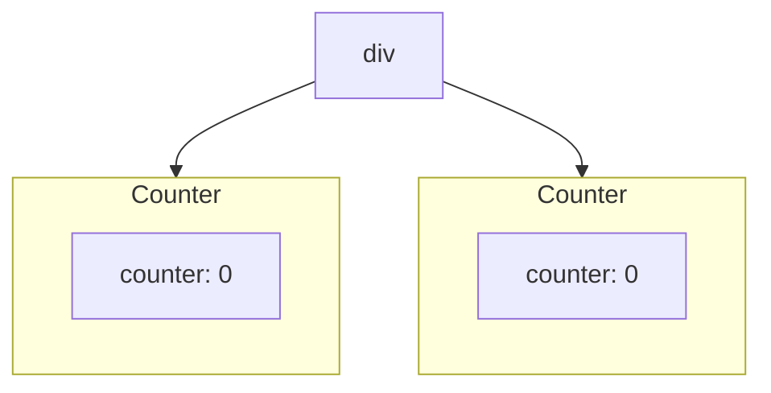

## State를 보존하고 초기화하기

### 리액트는 언제 State를 보존하고 언제 State를 초기화할까? ⇒ State는 렌더트리의 위치와 연결된다

```jsx
export default function App() {
  const counter = <Counter />;
  return (
    <div>
      {counter}
      {counter}
    </div>
  );
}

function Counter () {
...
}
```



- `Counter` 컴포넌트는 각각 자기 고유의 위치에서 렌더링된다.
- ⇒ 두 `Counter` 컴포넌트는 **자신만의 독립적인 state를 가지며 작동**한다.

<br/>

### 리액트는 트리의 동일한 컴포넌트를 동일한 위치에서 렌더링하는 동안 상태를 유지한다

```jsx
export default function App() {
  const [showB, setShowB] = useState(true);
  return (
    <div>
      <Counter />
      {showB && <Counter />}
    </div>
  );
}

function Counter() {
  ...
}

```

- `showB`가 `false`가 되어 두번째 `Counter`가 사라질 때 컴포넌트의 `state`도 같이 초기화된다.
- 다시 `showB`가 `true`로 바뀌면 `Counter`의 `state`는 초기값으로 세팅된다.
- ⇒ **리액트에서 컴포넌트가 제거될 때 컴포넌트의 `state`도 함께 제거된다**

<br/>

```jsx
import { useState } from 'react'

export default function App() {
  const [isFancy, setIsFancy] = useState(false)
  return <div>{isFancy ? <Counter isFancy={true} /> : <Counter isFancy={false} />}</div>
}
```

- 삼항연산자를 이용해 `isFancy = true`인 `Counter`와 `isFancy = false`인 `Counter` 컴포넌트를 조건부 렌더링할 때 `isFancy`가 `true`든 `false`든 `Counter` 컴포넌트는 같은 위치(**`App` 컴포넌트가 반환한 `div`의 첫번재 자식**)에 렌더링되어 `state`가 유지된다.
- ⇒ 리액트는 같은 위치에 있는 컴포넌트는 같은 컴포넌트로 간주한다.

> 🔴 리액트는 JSX 마크업에서가 아닌 반환된 UI 트리로 판단하여 이전 렌더링과 다음 렌더링 사이 컴포넌트를 연결한다.

### 같은 위치의 다른 컴포넌트는 state를 초기화한다

```jsx
import { useState } from 'react'

export default function App() {
  const [isFancy, setIsFancy] = useState(false)
  return (
    <div>
      {isFancy ? (
        <div>
          <Counter isFancy={true} />
        </div>
      ) : (
        <section>
          <Counter isFancy={false} />
        </section>
      )}
    </div>
  )
}
```

- `isFancy` 값에 따라 `div`가 `section`으로 바뀌었을 때 자식 컴포넌트인 `Counter`의 위치가 동일하더라도 모든 하위 트리까지 제거되었다가 새로 생성된다.

> 🔴 따라서 항상 컴포넌트는 중첩해서 정의하지 않고 최상위 범위에서 정의해야 한다.

```jsx
import { useState } from 'react'

export default function MyComponent() {
  const [counter, setCounter] = useState(0)

  function MyTextField() {
    const [text, setText] = useState('')

    return <input value={text} onChange={(e) => setText(e.target.value)} />
  }

  return (
    <>
      <MyTextField />
      <button
        onClick={() => {
          setCounter(counter + 1)
        }}
      >
        Clicked {counter} times
      </button>
    </>
  )
}
```

- `MyComponent`가 리렌더링 될 때마다 리액트는 `MyTextField` 함수 자체를 새로 정의하고 내부 상태(`text`)를 초기값으로 다시 설정한다.

<br/>

### 같은 위치에서 state를 초기화하고 싶다면?

1. 다른 위치에 컴포넌트 렌더링하기
2. 각 컴포넌트에 key값 명시하기

#### (1) 다른 위치에 컴포넌트 렌더링하기

```jsx
import { useState } from 'react'

export default function Scoreboard() {
  const [isPlayerA, setIsPlayerA] = useState(true)
  return (
    // 다른 위치에 렌더링
    <div>
      {isPlayerA && <Counter person='Taylor' />}
      {!isPlayerA && <Counter person='Sarah' />}
      <button
        onClick={() => {
          setIsPlayerA(!isPlayerA)
        }}
      >
        Next player!
      </button>
    </div>
  )
}
```

#### (2) key를 이용해 state를 초기화하기

기본적으로 리액트는 트리 상의 위치, 순서에 따라 컴포넌트를 구별한다.

위치와, 컴포넌트 명이 같을 때 리액트는 `key`를 이용해서 특정 컴포넌트를 구별할 수 있다.

```jsx
{
  isPlayerA ? <Counter key='Taylor' person='Taylor' /> : <Counter key='Sarah' person='Sarah' />
}
```

⇒ `key`를 사용하면 리액트는 부모 내에서의 순서 대신에 `key` 자체를 위치의 일부로 사용한다. 따라서 같은 위치에 렌더링되더라도 리액트는 `key`가 다르면 다른 컴포넌트로 인식한다.

> 🔴 key는 전역적으로 유일하지 않다. 오직 부모 요소 내부에서 각 항목의 위치를 식별하기 위한 용도이다.

<br/>

### 제거된 컴포넌트의 state 보존하기

Q. 컴포넌트가 트리에서 제거되면 `state`도 같이 초기화되는데, 제거된 컴포넌트가 다시 렌더링되었을 때 이전의 `state`값을 기억하고 싶으면 어떻게 해야할까?

A.

1. `css`로 컴포넌트 숨기기 → 트리에서 사라지는 것이 아니기 때문에 `state`를 유지할 수 있다.
2. `state`를 상위로 올리기 → 부모 컴포넌트가 유지되는 한, 자식 컴포넌트가 제거되어도 상관없다.
3. React state 이외의 다른 저장소 사용하기 ex) localStorage

<br/>

✨ 요약

- 리액트는 같은 컴포넌트가 같은 자리에 렌더링되는 한 state를 유지한다.
- state는 JSX 태그에 저장되지 않는다. state는 JSX로 만든 트리 위치와 연관된다.
- 컴포넌트에 다른 key를 주어 하위 트리를 강제로 초기화할 수 있다.
- 중첩해서 컴포넌트를 정의하면 원치 않게 state가 초기화될 수 있다.
